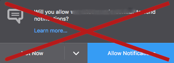

[](https://github.com/jhonatasrm/nBother/issues)
[](https://github.com/jhonatasrm/nBother/blob/master/LICENSE)
[]()
[]()
[](https://github.com/jhonatasrm/nBother/releases)


# nBother [](https://addons.mozilla.org/en-US/firefox/addon/nbother/)
Tired of receiving page notifications or being bothered by them asking permission to send notifications? Don't bother with that anymore!



## Requirements
* Firefox 58.0 or later

## How to test this Add-on

1. Clone this repository git clone ```https://github.com/jhonatasrm/nBother.git```
2. In the Firefox address bar type ```about:debugging```
3. Click ```Load Temporary Add-on```, a dialog window opens
4. In the cloned repository, select the ```manifest.json``` file. The webextension icon will appear in your toolbar

## How Contribute
Have a suggestion, doubt or encountered an error? Please open a new [issue](https://github.com/jhonatasrm/nBother/issues)

Contributions are welcome, feel free to submit a pull :)

## Learn More
To learn more about webextensions development, see this [Mozilla developer Network documentation](https://developer.mozilla.org/en-US/Add-ons/WebExtensions)

### License
This repository is available under the [Mozilla Public License, version 2.0](https://github.com/jhonatasrm/nBother/blob/master/LICENSE)
